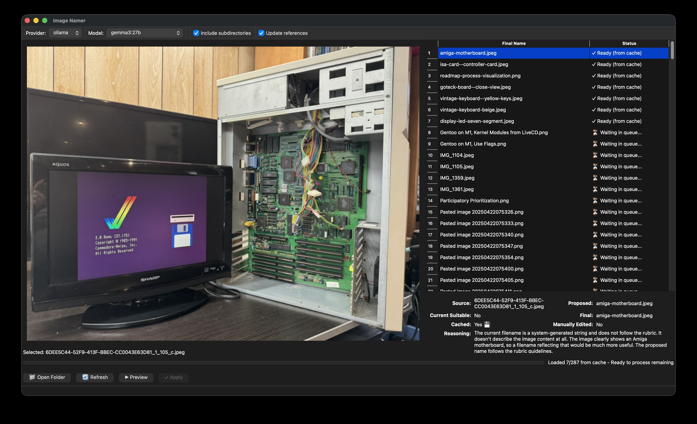

# Image Namer

**Rename image files based on their visual contents using AI vision models.**

[](LICENSE)
[](https://www.python.org/downloads/)

Transform generic filenames like `IMG_2347.jpg` into descriptive names like `golden-retriever-puppy--running-in-park.jpg` using AI vision analysis.



## Features

- 🤖 **AI-powered naming** using Ollama (local) or OpenAI (cloud)
- 🖥️ **Dual interface** - Choose command-line (CLI) or graphical (GUI) workflow
- 🏠 **Local-first** with Ollama for privacy
- ⚡ **Intelligent caching** to avoid redundant API calls
- 🔄 **Idempotent** - won't rename already-suitable files
- 📁 **Batch processing** with recursive folder support
- 📝 **Markdown reference updates** for Obsidian and standard markdown
- 🔍 **Dry-run mode** to preview changes safely (CLI)
- ✏️ **Manual editing** via table double-click (GUI)
- 🎯 **Smart collision handling**

## Quick Start

### Installation

Install Image Namer using [pipx](https://pipx.pypa.io/) for a clean, isolated installation:

```bash
# Install pipx (if needed)
brew install pipx  # macOS
# or: python3 -m pip install --user pipx

# CLI only (lightweight)
pipx install image-namer

# With GUI (includes Qt6 interface)
pipx install 'image-namer[gui]'

# Verify installation
image-namer --help         # CLI commands
image-namer-ui             # Launch GUI (if installed with [gui])
```

**Why pipx?** It installs Python CLI tools in isolated environments, preventing dependency conflicts with other projects.

### Setup AI Provider

Image Namer requires an AI vision model. Choose one:

**Option 1: Ollama (Recommended - Free & Local)**
```bash
# Install from https://ollama.com
ollama pull gemma3:27b
```

**Option 2: OpenAI (Cloud - Requires API Key)**
```bash
export OPENAI_API_KEY='sk-proj-...'
```

### Basic Usage

**Command Line (CLI)**
```bash
# Preview rename (dry-run)
image-namer file photo.jpg

# Apply rename
image-namer file photo.jpg --apply

# Process entire folder
image-namer folder ~/Pictures/screenshots --apply

# Update markdown references
image-namer folder ~/Documents/notes/images --apply --update-refs
```

**Graphical Interface (GUI)**
```bash
# Launch GUI application
image-namer-ui

# Then use the visual workflow:
# 1. Click "Open Folder" to select directory
# 2. Click "Process" to analyze images
# 3. Review/edit names in table (double-click to edit)
# 4. Click "Apply" to rename files
```

## Documentation

📚 **[Full Documentation](https://svetzal.github.io/image-namer/)** (comprehensive guides and reference)

Quick links:
- [Installation Guide](https://svetzal.github.io/image-namer/installation/) - Detailed setup instructions
- [Getting Started](https://svetzal.github.io/image-namer/getting-started/) - Your first rename
- [How-To Guides](https://svetzal.github.io/image-namer/how-to/single-file/) - Step-by-step workflows
- [CLI Reference](https://svetzal.github.io/image-namer/reference/cli-commands/) - Complete command docs

## Development

### Setup

```bash
# Clone repository
git clone https://github.com/svetzal/image-namer.git
cd image-namer

# Install with development dependencies (using uv)
uv venv
source .venv/bin/activate  # Windows: .venv\Scripts\activate
uv pip install -e ".[dev,gui]"  # Includes GUI for testing

# Or with pip
pip install -e ".[dev,gui]"
```

### Testing

```bash
pytest                    # Run all tests with coverage
pytest -v --no-cov       # Verbose without coverage
flake8 src               # Lint code
```

### Documentation

```bash
# Install docs dependencies (included in [dev])
pip install -e ".[dev]"

# Serve docs locally
mkdocs serve

# Build docs locally
mkdocs build
```

**Note**: Documentation is automatically deployed to GitHub Pages when a new release is published. See `docs/GITHUB_PAGES_SETUP.md` for details.

## Requirements

- Python 3.13 or later
- AI provider: Ollama (local) or OpenAI (cloud)

## License

MIT License - see [LICENSE](LICENSE)

## Project Status

🎉 **Version 2.0.0** - Production Ready with GUI

### Complete Features
✅ **Core Functionality**
- Single file and batch folder renaming with AI vision analysis
- Smart pre-flight assessment to skip already-suitable files
- Intelligent caching system (dramatically reduces LLM calls)
- Idempotent operations (won't rename if name already matches content)

✅ **Dual Interface**
- **CLI**: Command-line workflow with dry-run/apply modes
- **GUI**: Qt6 graphical interface with visual preview and editing

✅ **Markdown Integration**
- Automatic reference updates in standard Markdown and Obsidian
- Preserves alt text and aliases
- URL-encoded path handling

✅ **AI Providers**
- Ollama (local, privacy-focused, default)
- OpenAI (cloud-based)
- Easy provider switching via CLI or environment variables

✅ **Developer-Friendly**
- Comprehensive tests with high coverage
- Type-safe with Pydantic models
- Well-documented code and APIs
- Flake8 compliant

### What's Not Included (By Design)
- Video or PDF processing (images only)
- Multi-language filename support (English slugs)

See [CHANGELOG.md](CHANGELOG.md) for detailed release notes.
